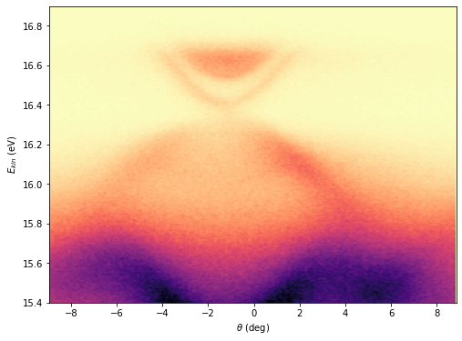
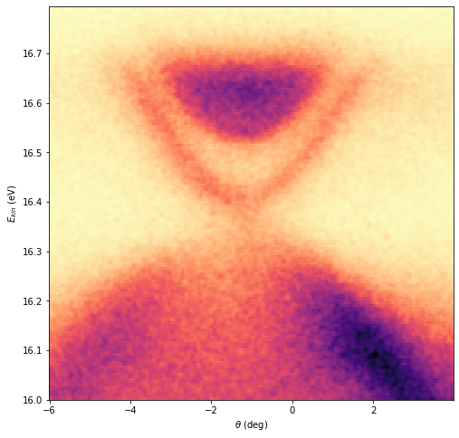

## Crop Image (2-Dimensionl data)

We can crop images (two-dimensionl data) using **crop_2d** function.

    import arpespythontools as arp

    # let's import our sample data
    [data, x, y] = arp.load_ses_spectra('sample_spectrum.txt')

    import matplotlib.pyplot as plt
    %matplotlib inline
    plt.figure(figsize = (8, 6))
    plt.imshow(data, origin = 'lower', aspect = 'auto', \
               extent = (y[0], y[-1], x[0], x[-1]))
    plt.xlabel("$\\theta$ (deg)")
    plt.ylabel('$E_{kin}$ (eV)')
    plt.set_cmap('magma_r')
    plt.show()

Now, we want to crop and see only the Dirac cone part. We want to crop the energy range (16, 16.8) and angle range (-6, 4).

    # data_crop, x_crop, y_crop = crop_2d(data, x, y, x_min, x_max, y_min, y_max)
    data_crop, x_crop, y_crop = arp.crop_2d(data, x, y, 16, 16.8, -6, 4)

    plt.figure(figsize = (8, 8))
    plt.imshow(data_crop, origin = 'lower', aspect = 'auto', \
               extent = (y_crop[0], y_crop[-1], x_crop[0], x_crop[-1]))
    plt.xlabel("$\\theta$ (deg)")
    plt.ylabel('$E_{kin}$ (eV)')
    plt.set_cmap('magma_r')
    plt.show()

This is what we wanted.
