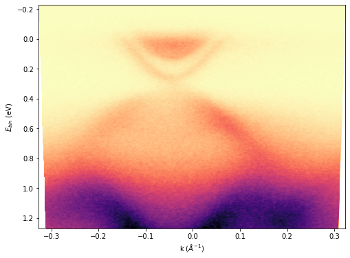

## k-space conversion for single spectra
The **k_conv** function can convert two-dimensional Energy vs Theta data to Binding energy vs **k** (momentum). Here Binding energy below the Fermi energy is positive convention used.

    import ARPES_Python_tools as arp  
    [data, energy, angle] = arp.load_ses_spectra('sample_spectra.txt')
    [data_k, e_bin, k] = arp.k_conv(data, energy, angle, 16.67) # Fermi energy = 16.67 eV  

    # Plot image
    import matplotlib.pyplot as plt
    %matplotlib inline
    # Above line is specific to Jupyter Notebook
    plt.figure(figsize = (8, 6))
    plt.imshow(data_k, origin = 'lower', aspect = 'auto', \
               extent = (k[0], k[-1], e_bin[0], e_bin[-1]))
    plt.xlabel("k ($\AA^{-1}$)")
    plt.ylabel('$E_{bin}$ (eV)')
    plt.set_cmap('magma_r')
    plt.show()

Which would produce a plot like this:  

## k-space conversion for 3D Fermi map data
Similarly, we can convert three dimensional (Energy, theta, phi)  Fermi map data to **k**-space by using **k_conv3D** function.

    [data, energy, theta, phi] = arp.load_ses_map('sample_map_data.zip')
    [data_k, e_bin, kx, ky] = arp.k_conv3D(data, energy, theta, phi, 16.67)
    # Fermi energy = 16.67 eV

Depending on the size of data and computing power, the program might take few minutes to complete the calculations.
