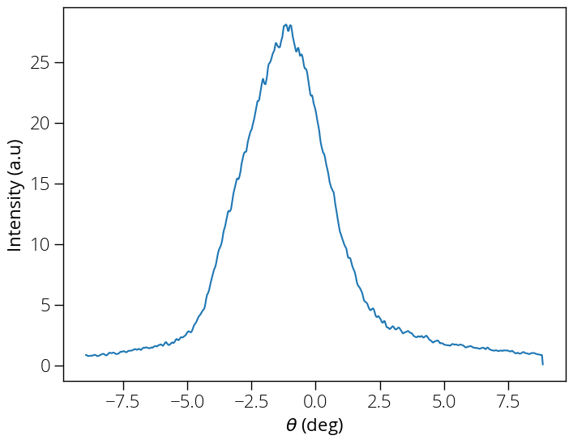

# Extracting line profile

How can we extract line profile from our two-dimensional image data? The function **line_profile** does the work. Let's say we want to extract an energy distribution curve from our ARPES spectrum.

    import ARPES_Python_tools as arp
    [data, energy, angle] = arp.load_ses_spectra('sample_spectra.txt')

    # We want to extract line profile between angles (-3, 3)
    edc = arp.line_profile(data, energy, angle, -3, 3)

    # Plot image
    import matplotlib.pyplot as plt
    %matplotlib inline
    # Above line is specific to Jupyter Notebook
    plt.figure(figsize = (8, 6))
    plt.plot(energy, edc)
    plt.xlabel('$E_{kin}$ (eV)')
    plt.ylabel('Intensity (a.u)')
    plt.show()

How about if we want the momentum distribution curve instead? That means we have to extract line profile along the other axis, which can be  done by transposing the data, and interchanging the axes:

    # We want to extract line profile between energy values (16.5, 16.7)
    mdc = arp.line_profile(data.T, angle, energy, 16.5, 16.7)

    # Plot image
    import matplotlib.pyplot as plt
    %matplotlib inline
    # Above line is specific to Jupyter Notebook
    plt.figure(figsize = (8, 6))
    plt.plot(angle, mdc)
    plt.xlabel('$\\theta$ (deg)')
    plt.ylabel('Intensity (a.u)')
    plt.show()

