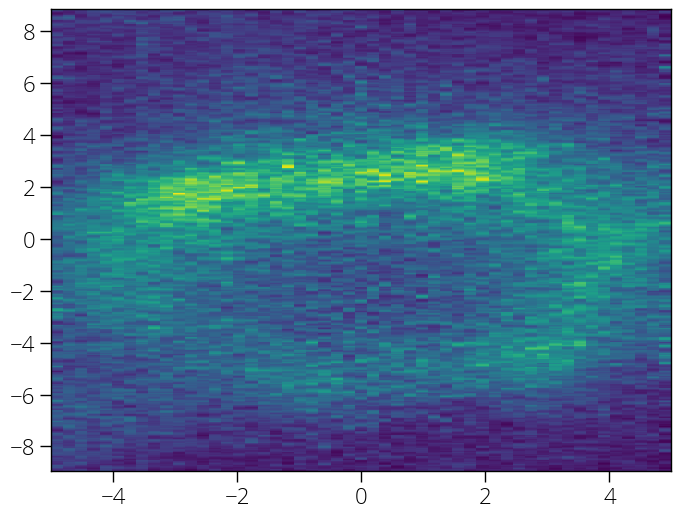
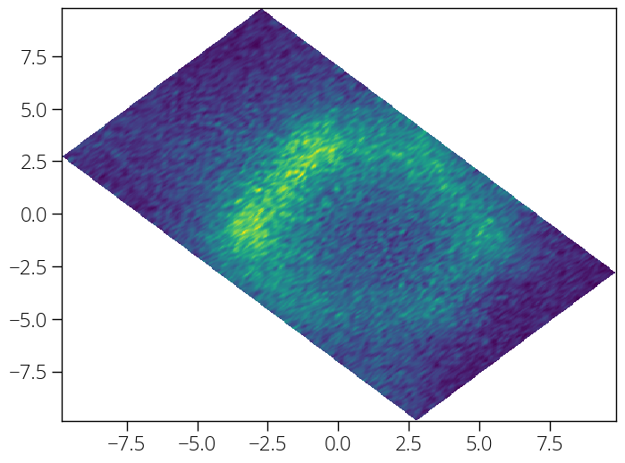

If your Fermi map measurement was not done keeping the high symmetry directions
along the slit direction (or perpendicular to the slit direction), and you need
to rotate the collected data in order to make the high symmetry directions along
the x- or y-coordinate, the `rotate` function comes handy.

This function needs the map data (3-dimensional array with first dimension along
the energy, second and third dimensions are $k_x$ and $k_y$, respectively.). It
also needs $k_x$ and $k_y$ vectors as input. Provide the required angle to
rotate in degree. The function returns rotated data, and new $k_x'$ and $k_y'$
vectors. Let's see an example:

```python
import arpespythontools as arp
import matplotlib.pyplot as plt
%matplotlib inline

# Let's import our sample map data
data, energy, theta, phi = arp.load_ses_map('sample_map_data.zip')

# Plot one slice
plt.figure(figsize = (8, 6))
plt.imshow(data[150, :, :], origin = 'lower', aspect = 'auto',\
            extent = (phi[0], phi[-1], theta[0], theta[-1]))
plt.show()
```

This is how a constant energy cut looks like before rotation:


Now, we can rotate the data.

```python
data_r, theta_r, phi_r = arp.rotate(data, 45, theta, phi)

# Plot one slice
plt.figure(figsize = (8, 6))
plt.imshow(data_r[150, :, :], origin = 'lower', aspect = 'auto',\
            extent = (phi_r[0], phi_r[-1], theta_r[0], theta_r[-1]))
plt.show()
```
Let us plot a slice again. This is what we get after the rotation.


:::caution

Note that rotating involves some heavy interpolation. So, this might take
several tens of minutes to complete depending on the size of data array and
computational power.

:::
